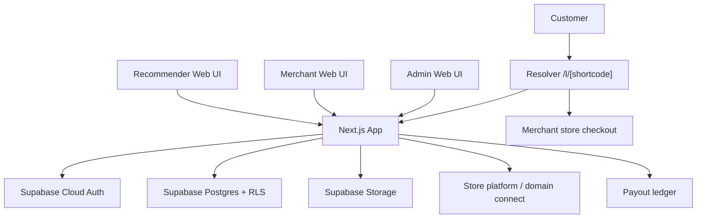

# Pintap Fresh Web App Scope, Architecture, And Requirements

Status: implementation scope for a new project
Target delivery window: 2 weeks
Target stack: one Next.js web application
Date: 2026-06-29

## 0. Read This First

This document is intentionally self-contained. The developer or agent using this file should not need access to the old repository and should not assume any previous Pintap app exists.

Pintap is a commerce referral product. A merchant connects their store by domain, creates a campaign for a product or store (including a customer discount and a recommender commission), and funds commission obligations in-app. A recommender creates a Pintap short link for that product/store, receives a unique discount code for that campaign, shares the link, and earns commission when a customer uses the link/code and purchases on the merchant's store. Payouts are tracked in an internal ledger — no third-party payment processor is in scope for the current product.

The new deliverable is one web app, not five separate apps. It must include the recommender app, merchant portal, admin portal, link resolver, domain-based store connection, in-app payout ledger, and Supabase backend integration in one Next.js project.

The build strategy is frontend-first:

- First build a polished web UI with mock data and fully clickable workflows.
- Then replace mock data with Supabase and typed service adapters for stores, campaigns, links, orders, and ledger.
- Do not build a native mobile app.
- Do not build a separate Express backend.
- Do not build a separate resolver frontend.
- Do not use local Supabase Docker as the main backend. Use Supabase Cloud.

## 1. Product Summary

### 1.1 Product Name And Brand

- Product name: Pintap.
- Slogan: Commerce by People.
- Mission: monetize everyday recommendations.
- Tone: optimistic, direct, trustworthy, action-oriented.
- Primary audience:
  - Recommenders who create and share links.
  - Merchants who connect stores by domain and fund campaigns.
  - Admins who operate the marketplace, investigate attribution, and manage users/campaigns.

### 1.2 Main Concept

Pintap turns personal recommendations into tracked commerce links.

1. A merchant connects their store to Pintap by verified domain.
2. The merchant creates a campaign with:
   - campaign name,
   - product/store destination,
   - discount percent,
   - commission percent,
   - start date,
   - optional end date,
   - discount code inventory.
3. A recommender finds or pastes a product URL in Pintap.
4. Pintap verifies the URL and matches it to a connected store domain.
5. Pintap shows active campaigns for that store/product.
6. The recommender selects a campaign.
7. Pintap reserves one discount code from that campaign for that recommender link.
8. Pintap creates a short link like `/l/A1b2C3d4`.
9. The recommender shares that link.
10. A customer opens the link and lands on Pintap's resolver page.
11. The resolver page shows product/store preview, recommender context, discount code, and a Continue button.
12. When the customer clicks Continue, Pintap records a click and redirects to the merchant store (with discount code applied when configured).
13. The customer purchases on the merchant store.
14. Pintap records attributed orders via admin sales import, manual confirmation, or future store-platform hooks.
15. Pintap matches the order discount code to the reserved link.
16. Pintap records the order, commission, and attribution.
17. Commission and payouts are tracked in an internal ledger; admin can queue and mark payouts without a third-party payment processor.

### 1.3 Hard Product Decisions

- [ ] Merchants connect stores by verified domain — no platform OAuth in current scope.
- [ ] A merchant is a store owner/operator with a connected domain on Pintap.
- [ ] A recommender can be any signed-in user.
- [ ] Customer checkout happens on the merchant store, not inside Pintap.
- [ ] Pintap does not process the customer's purchase payment.
- [ ] Order attribution uses sales import, manual admin confirmation, and/or future store-platform integration — not a hard dependency on a single commerce platform.
- [ ] Payouts use an in-app commission ledger; no third-party payment processor in current scope.
- [ ] For the 2-week MVP, payout batches can be marked paid manually, but ledger and payout states must be designed correctly.

## 2. Observed Old-App Functionality To Preserve

This section describes the behavior observed in the old codebase. Treat it as product reference, not as code to copy.

### 2.1 Old Application Inventory

The old product was split into multiple projects:

- `pintap-app-main`: Expo mobile app for recommenders.
- `pintap-studio-main`: Next.js Studio portal for admin, merchant, and user roles.
- `pintap-link-resolver-main`: separate Next.js public short-link resolver.
- `pintap-backend-main`: Express API with Prisma/Postgres.
- `pintap-sf-app-main`: legacy commerce app shell (dropped from new build).
- `commerce-integration-main`: duplicated legacy app shell (dropped from new build).

The new product must consolidate those into one Next.js app.

### 2.2 Old Mobile Recommender App Behavior

Observed screens and behavior:

- Auth:
  - email login,
  - email verification code bottom sheet,
  - Google sign-in placeholder/partial behavior,
  - registration wizard,
  - profile screen,
  - menu/help center.
- Home:
  - KPI cards for clicks, orders, conversion rate, commission,
  - quick URL paste box,
  - "Create Link" CTA,
  - "My Active Links" carousel,
  - "Discover Shops" carousel,
  - pull-to-refresh.
- Search:
  - segmented control for Shops and Products,
  - search input,
  - shop cards with commission, discount, active campaign count,
  - product results with visit/create-link actions.
- Create Link:
  - paste or type URL,
  - validate HTTP/HTTPS URL,
  - verify URL server-side,
  - infer link type,
  - infer shop/store name from URL when needed,
  - import/keep product image when available,
  - create recommendation link,
  - show success/failure state,
  - after creating link, show campaign selection bottom sheet,
  - let user connect campaign or skip campaign.
- My Links:
  - list generated links,
  - sort by newest, oldest, or name,
  - KPI summary for clicks, orders, commission,
  - link detail bottom sheet,
  - copy short link,
  - share short link,
  - open link preview,
  - edit link name/type,
  - activate/inactivate link,
  - delete link,
  - manage campaign connection,
  - view per-link clicks/orders/commission.

Preserve this experience in web form.

### 2.3 Old Studio Portal Behavior

Observed role-based portal:

- Roles:
  - admin,
  - merchant,
  - user.
- Shell:
  - left sidebar,
  - role switch pills,
  - quick page search,
  - locale switcher,
  - profile menu,
  - breadcrumbs,
  - large white content surface on soft beige/brand background.
- Admin pages:
  - dashboard,
  - users,
  - merchants,
  - campaigns,
  - links,
  - link orders,
  - sales import,
  - activity logs.
- Merchant pages:
  - dashboard,
  - merchants/store details,
  - campaigns,
  - link orders.
- User pages:
  - dashboard,
  - links,
  - link orders.

Observed campaign behavior:

- Campaign list with table columns:
  - campaign,
  - merchant/store,
  - campaign terms,
  - discount percent,
  - commission percent,
  - status,
  - discount codes used/available,
  - updated date.
- Campaign KPIs:
  - total campaigns,
  - active campaigns,
  - discount code count.
- Campaign create/edit form:
  - select connected store,
  - campaign name,
  - start date,
  - optional end date,
  - campaign terms,
  - discount percent,
  - commission percent,
  - create active campaign,
  - choose discount code source:
    - generate codes by prefix/count,
    - upload one code per line.
- Campaign detail dialog:
  - view store,
  - status,
  - discount,
  - commission,
  - dates,
  - terms,
  - discount code inventory,
  - claimed/available status,
  - claimed link name when available.
- Campaign management:
  - edit campaign,
  - add more discount codes,
  - stop active campaign.

Observed merchant/store behavior:

- Merchant list table:
  - logo,
  - merchant/store name,
  - domains,
  - country,
  - channel,
  - connected status,
  - active campaign count,
  - updated date.
- KPIs:
  - total merchants/stores,
  - connected stores,
  - stores with logo.
- Detail page concept:
  - store information,
  - domain connection/install result,
  - campaigns and links belonging to store.

Observed links behavior:

- Admin/user link table:
  - link name and short URL,
  - type,
  - status,
  - campaign connected/available,
  - shop/store,
  - created by,
  - clicks,
  - orders,
  - updated date.
- Link details:
  - type,
  - status,
  - brand,
  - shop/store,
  - created by,
  - destination URL,
  - short URL,
  - created/updated dates.

Observed link orders behavior:

- Orders are tracked against links.
- Order statuses include pending, confirmed, canceled, returned.
- Metrics include clicks, orders, earnings, commission, currency breakdown.

Observed sales import behavior:

- Admin can import sales from CSV.
- Preview and commit are separate.
- This is useful as a fallback/demo tool and as the primary order-ingestion path in current scope.

Observed activity log behavior:

- Logs exist for link created/updated/deleted, campaign connection, order import received/matched/unmatched, etc.

### 2.4 Old Resolver Behavior

Observed public route: `/l/[shortcode]`.

Resolver behavior:

- Validate shortcode as 8 base62 characters.
- Fetch active link by shortcode.
- If not found, show unavailable state.
- If fetch error, show temporary issue state.
- Show product image if safe URL exists.
- Show brand and shop/store.
- Show link/product name.
- If recommender first name exists, show "FirstName recommends this."
- If campaign discount code exists:
  - show discount percent badge,
  - show discount code,
  - allow copying discount code,
  - show campaign terms with expandable/collapsible terms.
- If no code exists:
  - show destination domain.
- Continue button:
  - creates or reads a visitor hash in localStorage,
  - records click event via `sendBeacon`/fetch,
  - redirects to the destination.

Preserve this route inside the single app as `/l/[shortcode]`.

### 2.5 Old Backend Business Rules

Observed backend rules:

- Link verification:
  - accepts only HTTP/HTTPS URLs,
  - blocks duplicate exact URL per user,
  - attempts to extract product metadata,
  - infers link type from URL.
- Link creation:
  - creates a store record from the destination domain when no store exists,
  - stores link name, brand, image, source host, short code,
  - records link_created score and activity events.
- Campaign connection:
  - only active campaigns can be connected,
  - campaign must belong to the same store as the link,
  - one current campaign assignment per link,
  - connecting reserves one available discount code,
  - replacing a campaign requires confirmation,
  - removing a campaign releases the code claim.
- Resolver redirect:
  - when a store is connected and a discount code exists, redirect to the merchant destination with the discount applied (e.g. store discount URL pattern or destination URL with code),
  - otherwise fallback to original URL.
  - optional referral tracking params may be added.
- Order attribution (legacy reference):
  - parses order discount codes from imported sales data,
  - finds active store connection by domain,
  - matches order discount code to current link campaign assignment,
  - attributes matched line item amount,
  - computes commission as order amount times campaign commission percent,
  - records/upserts link order event,
  - logs unmatched stores/codes/orders.
- Store connection (legacy reference):
  - merchant verifies store domain,
  - stores primary domain, storefront domains, and external store ID when available.

Preserve the business logic, but implement it in Supabase/Next.js style.

## 3. Current Problems To Fix In The New Build

- [ ] Do not keep the confusing term "merchant location" in the new UI. Use "Store."
- [ ] Merchant onboarding must start with domain-based store connection, not manual arbitrary store creation.
- [ ] Do not create store records only because a recommender pasted a random URL. For MVP, only connected merchant stores should become real campaign stores.
- [ ] Do not claim payout functionality unless ledger entries and payout state are present.
- [ ] Do not make the resolver a separate app.
- [ ] Do not rely on manual CSV sales import as the only long-term path — design for future store-platform hooks — but CSV import is acceptable for MVP order ingestion.
- [ ] Do not use a native mobile app for this 2-week deliverable.
- [ ] Do not make multiple projects with multiple deployment pipelines.
- [ ] Do not expose service-role Supabase keys or server-only secrets to the browser.

## 4. New App Architecture

### 4.1 One Application

Build a single Next.js app with:

- Next.js App Router.
- TypeScript.
- Tailwind CSS.
- Supabase Cloud for Auth, Postgres, Storage.
- Supabase SSR auth helpers for server-side session reads.
- Supabase service role only in server-only modules.
- Domain-based store connection and in-app payout ledger.
- Mock data adapters first, real data adapters second.

### 4.2 Deployment Shape

Recommended deployment:

- One Vercel project or equivalent Node-capable Next.js hosting.
- One Supabase Cloud project.
- One public app domain, for example:
  - `https://app.pintap.com`

Routes live under the same domain:

- Public/auth: `https://app.pintap.com`
- Recommender dashboard: `https://app.pintap.com/app`
- Merchant portal: `https://app.pintap.com/merchant`
- Admin portal: `https://app.pintap.com/admin`
- Resolver: `https://app.pintap.com/l/[shortcode]`
- Store connect API: `https://app.pintap.com/api/merchant/store-connect`

### 4.3 Architecture Diagram



### 4.4 App Route Map

Public:

- [x] `/` - simple public entry/login redirect page.
- [x] `/login` - login/sign up choice.
- [x] `/auth/callback` - Supabase auth callback.
- [x] `/auth/verify` - optional email OTP verify route if not handled inline.
- [x] `/l/[shortcode]` - public resolver page.

Recommender:

- [x] `/app` - recommender home/dashboard.
- [x] `/app/create-link` - create recommendation link.
- [x] `/app/links` - my links.
- [x] `/app/links/[id]` - link detail page or modal route.
- [x] `/app/discover` - discover connected stores/campaigns.
- [x] `/app/orders` - tracked orders from user's links.
- [x] `/app/payouts` - payout status and ledger.
- [x] `/app/profile` - profile and social handles.
- [x] `/app/help` - help center.

Merchant:

- [x] `/merchant` - merchant dashboard.
- [x] `/merchant/onboarding` - connect store and create first campaign.
- [x] `/merchant/store` - store profile and domain connection.
- [x] `/merchant/campaigns` - campaign list.
- [x] `/merchant/campaigns/new` - create campaign.
- [x] `/merchant/campaigns/[id]` - campaign detail/edit.
- [x] `/merchant/orders` - attributed store orders.
- [x] `/merchant/billing` - campaign funding / balance state.
- [x] `/merchant/settings` - store settings.

Admin:

- [x] `/admin` - platform dashboard.
- [x] `/admin/users` - users and roles.
- [x] `/admin/stores` - connected stores.
- [x] `/admin/campaigns` - all campaigns.
- [x] `/admin/links` - all links.
- [x] `/admin/orders` - all attributed orders.
- [x] `/admin/payouts` - payout review/approval.
- [x] `/admin/sales-import` - optional fallback CSV import.
- [x] `/admin/activity` - activity logs.
- [x] `/admin/settings` - platform configuration.

API routes:

- [ ] `/api/links/verify`
- [ ] `/api/links`
- [ ] `/api/links/[id]`
- [ ] `/api/links/[id]/campaign-options`
- [ ] `/api/links/[id]/campaign-connection`
- [ ] `/api/links/[id]/activate`
- [ ] `/api/links/[id]/inactivate`
- [ ] `/api/links/[id]/delete`
- [ ] `/api/links/resolve/[shortcode]`
- [ ] `/api/links/resolve/[shortcode]/click-events`
- [ ] `/api/campaigns`
- [ ] `/api/campaigns/[id]`
- [ ] `/api/campaigns/[id]/discount-codes`
- [ ] `/api/merchant/store-connect`

## 5. Data Model Requirements

Use Supabase Cloud Postgres. Use migrations. Enable RLS on user-facing tables. Use server-side service role only for trusted operations such as webhooks.

### 5.1 Core Tables

`profiles`

- [ ] `id uuid primary key references auth.users(id)`
- [ ] `email text`
- [ ] `first_name text`
- [ ] `last_name text`
- [ ] `avatar_url text`
- [ ] `phone text nullable`
- [ ] `country text nullable`
- [ ] `accepted_terms boolean default false`
- [ ] `created_at timestamptz`
- [ ] `updated_at timestamptz`

`user_roles`

- [ ] `id uuid primary key`
- [ ] `user_id uuid references profiles(id)`
- [ ] `role text check in ('user','merchant','admin')`
- [ ] `granted_by uuid nullable`
- [ ] `created_at timestamptz`
- [ ] unique `(user_id, role)`

`stores`

- [ ] `id uuid primary key`
- [ ] `name text`
- [ ] `slug text unique`
- [ ] `primary_domain text unique`
- [ ] `storefront_domain text`
- [ ] `external_store_id text unique nullable`
- [ ] `logo_url text nullable`
- [ ] `country_code text nullable`
- [ ] `currency text nullable`
- [ ] `connected boolean default false`
- [ ] `connected_at timestamptz nullable`
- [ ] `disconnected_at timestamptz nullable`
- [ ] `status text check in ('pending','active','paused','disconnected')`
- [ ] `created_at timestamptz`
- [ ] `updated_at timestamptz`

`store_members`

- [ ] `id uuid primary key`
- [ ] `store_id uuid references stores(id)`
- [ ] `user_id uuid references profiles(id)`
- [ ] `role text check in ('owner','staff')`
- [ ] `created_at timestamptz`
- [ ] unique `(store_id, user_id)`

`store_connections`

- [ ] `id uuid primary key`
- [ ] `store_id uuid references stores(id)`
- [ ] `primary_domain text unique`
- [ ] `storefront_domain text`
- [ ] `external_store_id text unique nullable`
- [ ] `verification_token text nullable`
- [ ] `is_active boolean default true`
- [ ] `connected_by uuid references profiles(id)`
- [ ] `connected_at timestamptz`
- [ ] `disconnected_at timestamptz nullable`

`store_domains`

- [ ] `id uuid primary key`
- [ ] `store_id uuid references stores(id)`
- [ ] `domain text unique`
- [ ] `is_primary boolean default false`
- [ ] `is_active boolean default true`

`campaigns`

- [ ] `id uuid primary key`
- [ ] `store_id uuid references stores(id)`
- [ ] `name text`
- [ ] `destination_url text nullable`
- [ ] `product_handle text nullable`
- [ ] `product_id text nullable`
- [ ] `terms text`
- [ ] `discount_percent numeric nullable`
- [ ] `commission_percent numeric nullable`
- [ ] `start_at timestamptz`
- [ ] `end_at timestamptz nullable`
- [ ] `is_active boolean default true`
- [ ] `status text check in ('draft','scheduled','active','paused','ended')`
- [ ] `created_by uuid references profiles(id)`
- [ ] `created_at timestamptz`
- [ ] `updated_at timestamptz`

`campaign_discount_codes`

- [ ] `id uuid primary key`
- [ ] `campaign_id uuid references campaigns(id)`
- [ ] `code text`
- [ ] `status text check in ('available','claimed','released','disabled')`
- [ ] `created_at timestamptz`
- [ ] unique `(campaign_id, code)`

`links`

- [ ] `id uuid primary key`
- [ ] `user_id uuid references profiles(id)`
- [ ] `store_id uuid references stores(id)`
- [ ] `campaign_id uuid nullable references campaigns(id)`
- [ ] `discount_code_id uuid nullable references campaign_discount_codes(id)`
- [ ] `type text check in ('product','shop','other')`
- [ ] `destination_url text`
- [ ] `source_host text`
- [ ] `name text`
- [ ] `brand text nullable`
- [ ] `image_url text nullable`
- [ ] `is_verified boolean default false`
- [ ] `short_code text unique`
- [ ] `short_url text`
- [ ] `status text check in ('active','inactive','deleted')`
- [ ] `created_at timestamptz`
- [ ] `updated_at timestamptz`
- [ ] `deleted_at timestamptz nullable`

`link_clicks`

- [ ] `id uuid primary key`
- [ ] `link_id uuid references links(id)`
- [ ] `visitor_hash text nullable`
- [ ] `user_agent text nullable`
- [ ] `country_code text nullable`
- [ ] `source text nullable`
- [ ] `clicked_at timestamptz`

`store_orders`

- [ ] `id uuid primary key`
- [ ] `store_id uuid references stores(id)`
- [ ] `external_order_id text`
- [ ] `order_number text`
- [ ] `currency text`
- [ ] `total_amount_minor integer`
- [ ] `processed_at timestamptz`
- [ ] `raw_payload jsonb`
- [ ] `created_at timestamptz`
- [ ] unique `(store_id, external_order_id)`

`link_order_attributions`

- [ ] `id uuid primary key`
- [ ] `link_id uuid references links(id)`
- [ ] `campaign_id uuid references campaigns(id)`
- [ ] `discount_code_id uuid references campaign_discount_codes(id)`
- [ ] `store_order_id uuid references store_orders(id)`
- [ ] `status text check in ('pending','confirmed','canceled','returned')`
- [ ] `order_amount_minor integer`
- [ ] `commission_amount_minor integer`
- [ ] `currency text`
- [ ] `source text default 'import'`
- [ ] `created_at timestamptz`
- [ ] unique `(link_id, store_order_id, discount_code_id)`

`commission_ledger_entries`

- [ ] `id uuid primary key`
- [ ] `user_id uuid references profiles(id)`
- [ ] `store_id uuid references stores(id)`
- [ ] `link_id uuid references links(id) nullable`
- [ ] `attribution_id uuid references link_order_attributions(id) nullable`
- [ ] `type text check in ('earned','reversed','payout_pending','paid','failed')`
- [ ] `amount_minor integer`
- [ ] `currency text`
- [ ] `status text check in ('pending','available','paid','reversed','failed')`
- [ ] `available_at timestamptz nullable`
- [ ] `metadata jsonb`
- [ ] `created_at timestamptz`

`merchant_funding_transactions`

- [ ] `id uuid primary key`
- [ ] `store_id uuid references stores(id)`
- [ ] `reference_id text nullable`
- [ ] `amount_minor integer`
- [ ] `currency text`
- [ ] `status text check in ('pending','paid','failed','refunded')`
- [ ] `created_at timestamptz`

`payout_batches`

- [ ] `id uuid primary key`
- [ ] `user_id uuid references profiles(id)`
- [ ] `reference_id text nullable`
- [ ] `amount_minor integer`
- [ ] `currency text`
- [ ] `status text check in ('draft','queued','paid','failed','canceled')`
- [ ] `created_at timestamptz`
- [ ] `paid_at timestamptz nullable`

`activity_events`

- [ ] `id uuid primary key`
- [ ] `scope_type text`
- [ ] `scope_id uuid nullable`
- [ ] `actor_type text check in ('user','system')`
- [ ] `actor_id uuid nullable`
- [ ] `event_type text`
- [ ] `event_data jsonb`
- [ ] `created_at timestamptz`

### 5.2 Storage Buckets

- [ ] `avatars` - profile images.
- [ ] `store-logos` - store logos.
- [ ] `link-images` - imported product images.
- [ ] `imports` - optional CSV imports.

### 5.3 RLS Requirements

- [ ] Users can read/update their own profile.
- [ ] Users can read their own links and link metrics.
- [ ] Users can create/update/delete their own links.
- [ ] Users cannot edit campaigns unless they are merchant/admin.
- [ ] Merchants can read/update stores where they are `store_members`.
- [ ] Merchants can manage campaigns only for their own stores.
- [ ] Merchants can read order attributions only for their own stores.
- [ ] Admins can read all data.
- [ ] Webhooks use server-side service role and must validate signatures before writes.

## 6. Store Connection And Payout Ledger

Removed from current scope — store connection is domain-based; payouts/ledger are in-app only for now.

## 7. Legacy Platform Integrations

Removed from current scope — store connection is domain-based; payouts/ledger are in-app only for now.

## 8. Functional Requirements

### 8.1 Authentication And Roles

- [ ] Use Supabase Auth.
- [ ] Support email/password or magic link/OTP.
- [ ] Support Google OAuth if time allows.
- [ ] Create `profiles` row after signup.
- [ ] Default new user role: `user`.
- [ ] Merchant role is granted when store connection starts or completes.
- [ ] Admin role is manually seeded/granted.
- [ ] Protect `/app`, `/merchant`, and `/admin`.
- [ ] Redirect signed-out users to `/login`.
- [ ] Redirect users without role access to an access-denied page.
- [ ] Show role switch only for users with multiple roles.

### 8.2 Recommender Home

- [ ] Show KPI cards:
  - total clicks,
  - total orders,
  - conversion rate,
  - total commission.
- [ ] Show currency-aware commission display.
- [ ] Show quick URL paste/create module.
- [ ] Validate URL before enabling Create button.
- [ ] Show active links carousel/table.
- [ ] Show discoverable connected stores/campaigns.
- [ ] Show loading skeletons.
- [ ] Show empty states.
- [ ] Show refresh action.

### 8.3 Discover Stores/Campaigns

- [ ] Search connected stores.
- [ ] Show store cards with:
  - logo,
  - store name,
  - category if available,
  - active campaign count,
  - best discount percent,
  - best commission percent.
- [ ] Show campaign cards/details:
  - campaign name,
  - discount percent,
  - commission percent,
  - terms,
  - active dates,
  - available code count.
- [ ] CTA: create link for store/product.
- [ ] Do not show unconnected stores as real campaign stores.

### 8.4 Create Recommendation Link

- [ ] Allow recommender to paste/type a URL.
- [ ] URL must be HTTP/HTTPS.
- [ ] Verify destination server-side.
- [ ] Detect hostname and match it to a connected store domain.
- [ ] If no connected store exists, show "This store is not on Pintap yet" and allow creating a basic non-earning saved link only if explicitly wanted.
- [ ] For earning links, require an active campaign from the matched store.
- [ ] Show product/store preview:
  - image,
  - name,
  - brand,
  - store,
  - destination URL.
- [ ] Show available campaign options.
- [ ] Let user select campaign.
- [ ] Reserve exactly one discount code for the link.
- [ ] Generate unique 8-character base62 shortcode.
- [ ] Save link with active status.
- [ ] Show success state.
- [ ] Offer actions:
  - copy link,
  - share link,
  - view link detail,
  - open resolver preview.

### 8.5 My Links

- [ ] List user's links.
- [ ] Support sort:
  - newest,
  - oldest,
  - name A-Z.
- [ ] Support filters:
  - active,
  - inactive,
  - deleted hidden by default,
  - campaign connected/unconnected.
- [ ] Each link row/card shows:
  - image,
  - name,
  - store,
  - short URL,
  - status,
  - campaign/code status,
  - clicks,
  - orders,
  - commission.
- [ ] Link detail shows:
  - destination URL,
  - resolver URL,
  - discount code,
  - campaign terms,
  - metrics,
  - created/updated dates.
- [ ] Actions:
  - copy short link,
  - share via Web Share API where available,
  - open resolver preview,
  - edit display name,
  - change type if needed,
  - activate,
  - inactivate,
  - delete.
- [ ] Campaign management:
  - show current campaign,
  - show available campaigns for same store,
  - connect/switch campaign with confirmation,
  - remove campaign and release code.

### 8.6 Resolver

- [ ] Route: `/l/[shortcode]`.
- [ ] Validate shortcode format.
- [ ] Load active link by shortcode.
- [ ] Show not-found/invalid state.
- [ ] Show temporary issue state.
- [ ] Show Pintap logo/branding.
- [ ] Show recommender context when available.
- [ ] Show product/store image.
- [ ] Show brand and store name.
- [ ] Show product/link name.
- [ ] Show discount badge if discount percent exists.
- [ ] Show discount code in a copyable block.
- [ ] Show campaign terms collapsed with expand option.
- [ ] Show destination host if no discount code.
- [ ] Continue button records click event.
- [ ] Use localStorage visitor hash for repeat visitor tracking.
- [ ] Redirect logic:
  - if store is connected and code exists, redirect to merchant destination with discount applied,
  - else redirect to destination URL.
- [ ] Click tracking must not block redirect.
- [ ] Page must be fast and mobile-first.

### 8.7 Merchant Onboarding

- [ ] Merchant signs up/logs in.
- [ ] Merchant sees onboarding checklist:
  - connect store by domain,
  - confirm store profile,
  - set campaign funding / balance,
  - create first campaign.
- [ ] Merchant enters store domain.
- [ ] Complete domain-based store connection flow.
- [ ] On success, create store and grant merchant ownership.
- [ ] On failure, show clear error and retry CTA.
- [ ] Show connected store domain, external store ID when available, and connection status.
- [ ] Handle store disconnection by marking store disconnected.

### 8.8 Merchant Dashboard

- [ ] Show store KPIs:
  - active campaigns,
  - issued links,
  - clicks,
  - attributed orders,
  - commission owed,
  - funded balance.
- [ ] Show recent orders.
- [ ] Show active campaigns.
- [ ] Show low-code inventory warnings.
- [ ] Show store connection status.
- [ ] Show funding/payout alerts.

### 8.9 Campaign Management

- [ ] Merchant/admin can create campaign for a connected store.
- [ ] Required fields:
  - store,
  - campaign name,
  - destination URL or product,
  - start date,
  - terms,
  - discount percent,
  - commission percent,
  - discount code source.
- [ ] Optional fields:
  - end date,
  - product image/metadata,
  - max budget,
  - max claims.
- [ ] Discount code source:
  - generate codes with prefix/count,
  - upload codes one per line.
- [ ] Validate discount percent 0-100.
- [ ] Validate commission percent 0-100.
- [ ] Validate code count 1-500 for MVP.
- [ ] Campaign list shows status and code usage.
- [ ] Campaign detail shows claimed/available codes.
- [ ] Can add additional codes.
- [ ] Can edit name/dates/terms/percentages.
- [ ] Can pause/stop active campaign.
- [ ] Cannot activate campaign if store is disconnected.
- [ ] Cannot activate earning campaign if funding requirements are not met, unless admin/demo mode allows manual payout.

### 8.10 Order Attribution

- [ ] Implement sales CSV import and/or manual order entry.
- [ ] Normalize imported order payload.
- [ ] Extract:
  - order ID,
  - order number,
  - processed/created date,
  - currency,
  - total price,
  - discount codes,
  - line items.
- [ ] Resolve store by primary domain or storefront domain.
- [ ] If store not connected, record activity and skip attribution.
- [ ] If no discount codes, record unmatched.
- [ ] Match discount code to current link campaign assignment.
- [ ] Attribute order amount to the matched code/link.
- [ ] Compute commission from campaign commission percent.
- [ ] Upsert `store_orders`.
- [ ] Upsert `link_order_attributions`.
- [ ] Create commission ledger entry.
- [ ] Log matched and unmatched codes.
- [ ] Expose attributed order in user, merchant, and admin dashboards.

### 8.11 Payouts And Ledger

- [ ] Recommender payout page shows:
  - available balance,
  - pending balance,
  - paid total,
  - ledger history,
  - payout eligibility status.
- [ ] If payout details incomplete, show "Complete payout setup" CTA (in-app profile/bank details when implemented).
- [ ] Ledger entries created from confirmed attributions.
- [ ] Admin payout page lists payable users.
- [ ] Admin can queue payout batch.
- [ ] Payout batch can be marked paid in manual mode.
- [ ] Store payout reference ID and status on batch when paid.

### 8.12 Admin

- [ ] Admin dashboard with platform KPIs:
  - users,
  - connected stores,
  - active campaigns,
  - links,
  - clicks,
  - orders,
  - commission owed,
  - payout pending.
- [ ] Admin users page:
  - list users,
  - search,
  - roles,
  - active/inactive status.
- [ ] Admin stores page:
  - list connected stores,
  - connection status,
  - owners,
  - active campaigns.
- [ ] Admin campaigns page:
  - all campaigns,
  - code usage,
  - edit/stop/add codes.
- [ ] Admin links page:
  - all links,
  - creator,
  - store,
  - status,
  - clicks/orders/commission.
- [ ] Admin orders page:
  - all attributed orders,
  - unmatched import events,
  - status.
- [ ] Admin payouts page:
  - ledger,
  - payable users,
  - payout batches.
- [ ] Admin activity page:
  - searchable activity log.
- [ ] Admin sales import:
  - optional CSV preview/commit fallback for demos.

## 9. UI And Design Requirements

### 9.1 Brand Tokens

Use these exact tokens:

- [x] Navy: `#002E51`
- [x] Orange: `#FA5004`
- [x] Yellow: `#FFFD57`
- [x] Green: `#45DB89`
- [x] Beige: `#ECE7E4`
- [x] Accent blue: `#41C9FE`
- [x] Accent pink: `#FAB0E8`
- [x] UI gray: `#E0DFE4`

Typography:

- [x] Use Plus Jakarta Sans.
- [x] Fallback stack: `"Plus Jakarta Sans", "Avenir Next", "Segoe UI", sans-serif`.
- [x] Use extra bold for headings/KPIs.
- [x] Use regular text for body.
- [x] Do not use tiny low-contrast text for important financial values.

### 9.2 Visual Direction

The UI should feel like the old Pintap Studio/mobile direction:

- [ ] clean commerce dashboard,
- [ ] soft beige page background,
- [ ] navy text,
- [ ] orange primary CTA,
- [ ] green for earned/positive values,
- [ ] blue for informational accents,
- [ ] white content surfaces,
- [ ] rounded inputs/buttons around 12-14px,
- [ ] cards around 12-16px for repeated items,
- [ ] strong but restrained shadows,
- [ ] mobile-first recommender flows,
- [ ] dense but readable merchant/admin tables.

Avoid:

- [ ] purple-heavy SaaS template look,
- [ ] generic dark dashboard,
- [ ] marketing-only landing page as the first deliverable,
- [ ] vague "AI" decorative content,
- [ ] nested cards inside cards,
- [ ] giant hero sections for the operational app,
- [ ] using "merchant location" in visible UI.

### 9.3 Global Layouts

Recommender layout:

- [ ] top nav or compact app header,
- [ ] bottom nav on mobile:
  - Home,
  - Discover,
  - Create,
  - Links,
  - Profile.
- [ ] desktop sidebar or top tabs.
- [ ] optimized for quick paste/create/share.

Merchant/admin layout:

- [ ] left sidebar on desktop,
- [ ] collapsible mobile sidebar,
- [ ] sticky top header,
- [ ] quick search,
- [ ] profile menu,
- [ ] breadcrumbs,
- [ ] role switcher if user has multiple roles.

Resolver layout:

- [ ] centered mobile card/page,
- [ ] logo at top,
- [ ] product image,
- [ ] product/store details,
- [ ] discount code module,
- [ ] Continue CTA,
- [ ] lightweight trust copy.

### 9.4 Components

- [x] Button variants:
  - primary orange,
  - secondary outline,
  - ghost,
  - danger.
- [x] Inputs:
  - text,
  - URL,
  - number,
  - date/time,
  - textarea,
  - select.
- [x] Segmented control for tabs/modes.
- [x] KPI cards.
- [x] Data table with search/sort/pagination.
- [x] Status badges.
- [x] Toasts.
- [x] Modal/dialog.
- [x] Drawer/sheet for mobile details.
- [x] Copy button with copied state.
- [x] Skeleton loaders.
- [x] Empty states.
- [x] Error states.
- [x] Confirmation dialogs for destructive actions.

## 10. Frontend-First Mock Data Plan

### 10.1 Required Pattern

Implement typed service adapters from day one:

- [ ] `src/services/links.ts`
- [ ] `src/services/campaigns.ts`
- [ ] `src/services/stores.ts`
- [ ] `src/services/orders.ts`
- [ ] `src/services/payouts.ts`
- [ ] `src/services/auth.ts`
- [ ] `src/services/analytics.ts`
- [ ] `src/services/activity.ts`

Each service must support:

- [ ] mock implementation,
- [ ] real implementation,
- [ ] shared TypeScript types,
- [ ] no UI component directly importing mock arrays.

Example:

```ts
export interface LinksService {
  listMyLinks(): Promise<LinkSummary[]>;
  verifyUrl(url: string): Promise<LinkVerificationResult>;
  createLink(input: CreateLinkInput): Promise<LinkDetail>;
}
```

### 10.2 Mock Data Requirements

Mock data must include:

- [ ] at least 3 recommenders,
- [ ] at least 3 connected stores,
- [ ] at least 5 campaigns,
- [ ] campaigns with available and exhausted discount codes,
- [ ] at least 10 links,
- [ ] links with and without campaigns,
- [ ] links with clicks/orders/commission,
- [ ] at least 5 attributed store orders,
- [ ] at least 1 unmatched order,
- [ ] payout ledger entries,
- [ ] merchant funding states.

### 10.3 Mock Workflow Requirements

Even before backend is connected:

- [ ] User can create a link from URL.
- [ ] User can select campaign.
- [ ] Mock service reserves a discount code.
- [ ] Link appears in My Links.
- [ ] Resolver can open the link by shortcode.
- [ ] Continue button updates mock click count or logs event.
- [ ] Merchant can create campaign.
- [ ] Merchant can add codes.
- [ ] Admin can inspect links/orders/payouts.
- [ ] Store connect and payout screens show realistic pending/connected/error states.

## 11. Implementation Phases

### Phase 0 - Project Setup

- [x] Create Next.js app with TypeScript and Tailwind.
- [x] Add Plus Jakarta Sans.
- [x] Add brand tokens.
- [x] Add route groups for public, app, merchant, admin, resolver, api.
- [x] Add mock service layer and seed data.
- [x] Add Supabase client/server helpers but keep mock mode enabled.
- [x] Add lint/typecheck scripts.

### Phase 1 - Frontend MVP With Mock Data

- [x] Auth screens.
- [x] Recommender home.
- [x] Discover stores/campaigns.
- [x] Create link flow.
- [x] My Links list/detail.
- [x] Resolver page.
- [x] Merchant onboarding mock.
- [x] Merchant dashboard.
- [x] Campaign list/create/detail.
- [x] Admin dashboard.
- [x] Admin tables for users/stores/campaigns/links/orders/payouts/activity.
- [x] Responsive mobile and desktop QA.

### Phase 2 - Supabase Auth And Database

- [ ] Create Supabase Cloud project.
- [ ] Add env vars.
- [ ] Create migrations.
- [ ] Enable RLS.
- [ ] Implement Supabase Auth.
- [ ] Replace profile/role mock services.
- [ ] Replace links/campaigns/stores mock services gradually.
- [ ] Add storage buckets.
- [ ] Add seed script for demo data.

### Phase 3 - Hardening And Demo Polish

- [ ] Access control audit.
- [ ] Import idempotency.
- [ ] Error states.
- [ ] Empty states.
- [ ] Loading states.
- [ ] Responsive QA.
- [ ] End-to-end happy path demo:
  - merchant connects store by domain,
  - merchant creates campaign,
  - recommender creates link,
  - customer opens resolver,
  - click recorded,
  - order imported or manually attributed,
  - commission ledger updated.

## 12. Environment Variables

Required:

- [ ] `NEXT_PUBLIC_APP_URL`
- [ ] `NEXT_PUBLIC_SUPABASE_URL`
- [ ] `NEXT_PUBLIC_SUPABASE_PUBLISHABLE_KEY`
- [ ] `SUPABASE_SECRET_KEY`
- [ ] `APP_ENCRYPTION_KEY` for sensitive server-side tokens when needed

Optional:

- [ ] `MOCK_DATA_ENABLED`
- [ ] `ADMIN_SEED_EMAIL`
- [ ] `RESOLVER_CLICK_SECRET` if internal click endpoint needs extra guard

## 13. Security Requirements

- [ ] Never expose service role key to client.
- [ ] Never expose server-only secrets to client.
- [ ] Validate all route inputs with Zod or equivalent.
- [ ] Use idempotency keys or unique constraints for imports and webhooks.
- [ ] Enforce role checks server-side.
- [ ] RLS must protect direct Supabase access.
- [ ] Sanitize and validate redirect URLs.
- [ ] Resolver must only redirect to the stored destination or configured discount URL, not arbitrary query params.

## 14. Testing Requirements

- [ ] Unit tests for shortcode generation.
- [ ] Unit tests for store domain normalization.
- [ ] Unit tests for discount redirect URL creation.
- [ ] Unit tests for campaign code reservation/release.
- [ ] Unit tests for order import attribution.
- [ ] Unit tests for commission calculation.
- [ ] Integration tests for Supabase RLS policies where possible.
- [ ] E2E test for recommender create-link flow.
- [ ] E2E test for resolver continue flow.
- [ ] E2E test for merchant campaign creation.
- [ ] E2E or scripted test for sales import simulation.

## 15. Acceptance Criteria

The MVP is acceptable when:

- [ ] One Next.js app runs locally and deploys as one web application.
- [ ] No native mobile build is required.
- [ ] No separate resolver app is required.
- [ ] No separate Express backend is required.
- [ ] UI is complete and realistic with mock data before backend cutover.
- [ ] Supabase Auth works.
- [ ] User, merchant, and admin role gating works.
- [ ] Merchant can connect store by domain or complete the connection flow in test mode.
- [ ] Merchant can create campaign with discount code inventory.
- [ ] Recommender can create a link for a connected store campaign.
- [ ] Resolver page displays the link and redirects correctly.
- [ ] Clicks are tracked.
- [ ] Sales import or manual attribution attributes an order to a link using discount code.
- [ ] Commission ledger updates.
- [ ] Payout page and ledger model are present and honest about manual vs automated payout state.

## 16. Reference Links

Use official docs while implementing:

- Supabase Next.js guide: `https://supabase.com/docs/guides/getting-started/quickstarts/nextjs`
- Supabase SSR auth: `https://supabase.com/docs/guides/auth/server-side/nextjs`
- Supabase RLS: `https://supabase.com/docs/guides/database/postgres/row-level-security`
- Supabase Storage access control: `https://supabase.com/docs/guides/storage/security/access-control`

## 17. Agent Rules For Building This

- [ ] Treat this document as the product source of truth.
- [ ] Do not invent extra business models.
- [ ] Do not rename core concepts without updating the whole UI.
- [ ] Keep "Store" for merchant-facing UI, not "merchant location."
- [ ] Store connection is domain-based in current scope.
- [ ] Build frontend workflows with mock data first.
- [ ] Keep backend behind service adapters.
- [ ] Replace mock services one by one.
- [ ] Keep checkboxes updated as work completes.
- [ ] Do not mark payout complete until ledger behavior exists.
- [ ] Keep the app deployable as one project.
